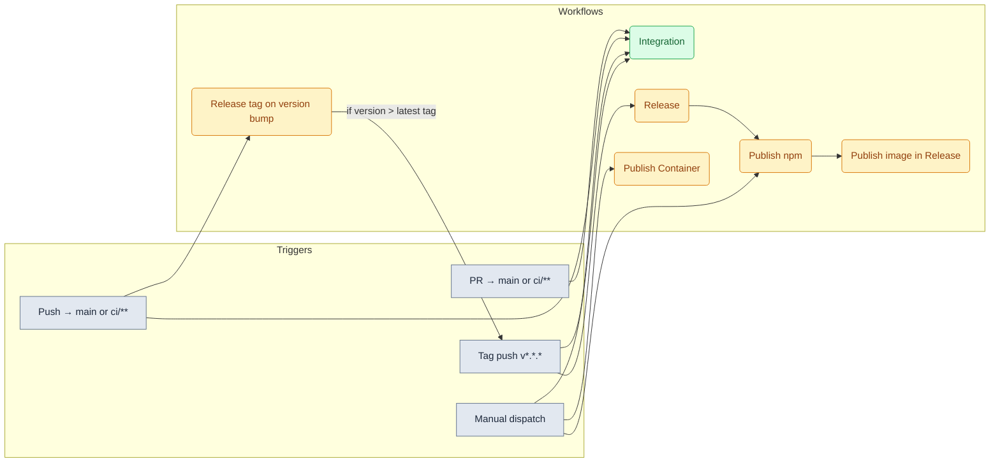
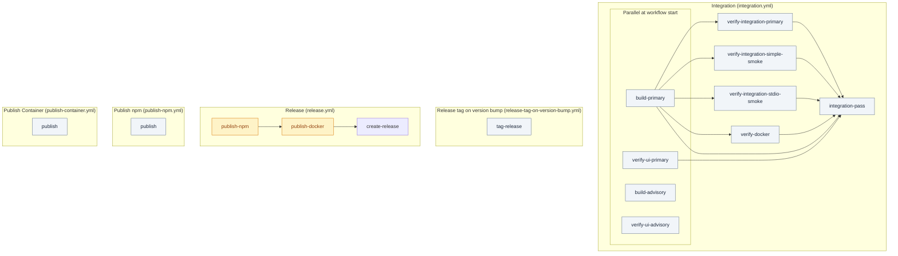
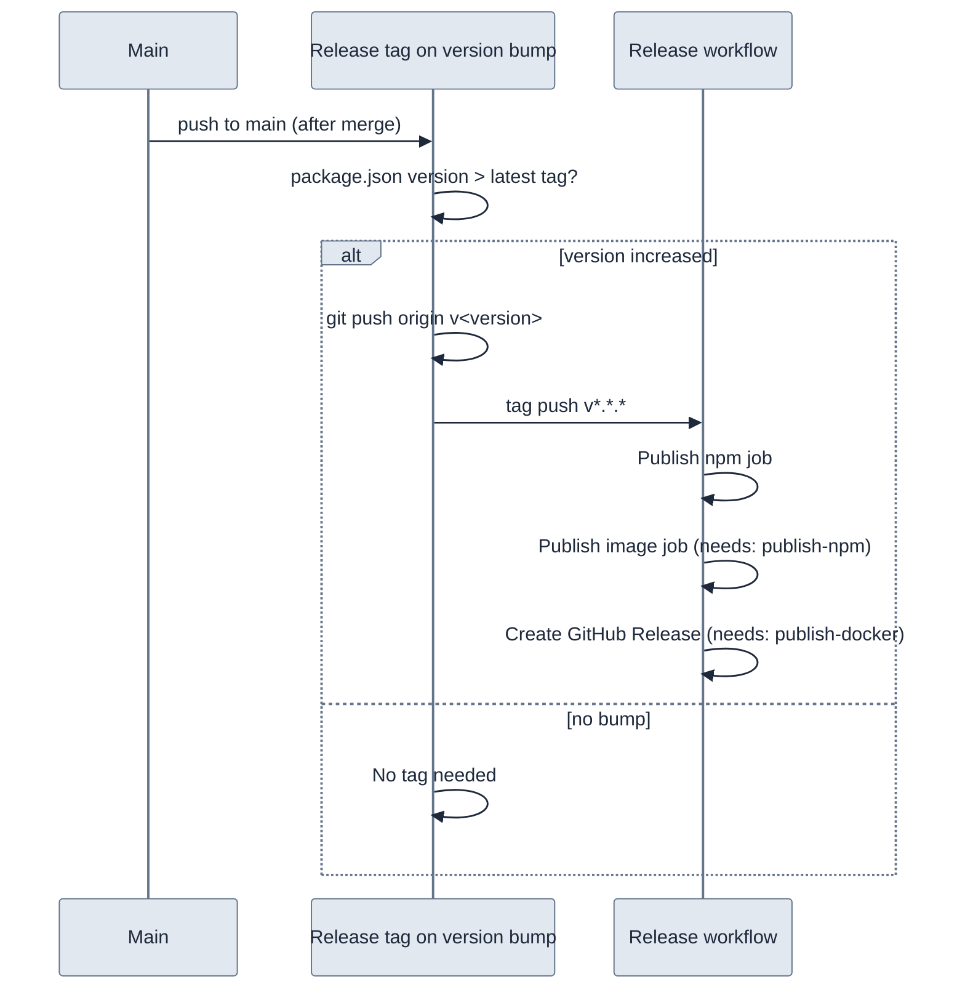

# GitHub Actions – workflow design

<!-- kairos-lint-allow-protocol-synonyms -->

## Overview

**Release path (normal flow):** Version-bump PR merged to main → **Release tag on version bump** runs; if `package.json` version &gt; latest tag, it pushes that tag → **Release** runs on tag push (publish npm → publish Docker → create GitHub Release).

**Integration:** Runs on every PR and push to **main** or **`ci/**`** (integration and beta lines such as `ci/integration-line`), and on tag push to re-verify the released ref. Manual run available. Without a push (or PR) trigger on those `ci/**` branches, **Release tag on version bump** never sees a successful **Integration** `workflow_run`, so beta tags are not created automatically after CI green.

**PR/MR tooling:** This repo uses the GitHub CLI (**gh**) for PRs. For GitLab MRs use **glab**. KAIROS protocols: *GitHub PR with gh* (create/track PRs with `gh`), *GitLab MR with glab* (create/track MRs with `glab`).

### GitHub PR protocol notes: skip CI and required checks

For the GitHub PR flow, treat these as hard rules:

- Required checks are configured in GitHub repository settings (branch
  protection or rulesets), not in workflow YAML.
- Workflow files define jobs and check names, but they do not decide which
  checks block merge.
- Current `main` required checks are:
  - `Integration workflow passed`

  The former `Integration simple workflow passed` and `Integration stdio
  workflow passed` checks were retired when the simple and stdio stacks were
  folded into **Integration** as transport-smoke jobs; remove them from branch
  protection if still listed.
- `[skip ci]` style tokens only apply to workflows triggered by `push` and
  `pull_request`, and PR behavior depends on the HEAD commit message.
- If skip instructions are used but checks still run, verify the latest commit
  message first, then verify required checks in branch protection settings.

**Dependabot:** Auto-merge is enabled at repository level (Settings → General → Pull Requests → Allow auto-merge). On each Dependabot PR, use **Enable auto-merge**; the PR will merge when required status checks pass. No workflow is used for this.

**Manual-only:** Publish npm and Publish Container are for ad-hoc republish/debug; they use `package.json` version when not run from a tag.

## Workflows and job dependencies

Each workflow is made of one or more **jobs**. Arrows show `needs:` — the target job runs only after the source job succeeds.

| Workflow | Job(s) | Dependencies |
|----------|--------|--------------|
| Integration | `build-primary` (24) ∥ `build-advisory` (25–26, COE) ∥ `verify-ui-primary` (24) ∥ `verify-ui-advisory` (25–26, COE); then `verify-integration-primary` (AUTH full suite, needs `build-primary`) ∥ `verify-integration-simple-smoke` (needs `build-primary`) ∥ `verify-integration-stdio-smoke` (needs `build-primary`) ∥ `verify-integration-advisory` (needs `build-advisory`, COE) ∥ `verify-docker` (needs `build-primary`, image-gated); → `integration-pass` | `integration-pass` needs `build-primary`, `verify-ui-primary`, `verify-integration-primary`, `verify-integration-simple-smoke`, `verify-integration-stdio-smoke`, `verify-docker` (all advisory jobs omitted from `needs`; `verify-docker` required only when image-affecting files change) |
| Security | `dependency-review`, `npm-audit`, `codeql` | — (parallel jobs) |
| Release tag on version bump | `tag-release` | — |
| Release | `publish-npm` → `publish-docker` → `create-release` | `publish-docker` and `create-release` need `publish-npm`; `create-release` needs `publish-docker` |
| Publish npm | `publish` | — |
| Publish image (in Release) | `publish-docker` | after `publish-npm` |
| Publish Container | `publish` | — |

## Integration workflow

### Secrets and variables

The integration workflow uses **optional secrets:** `OPENAI_API_KEY` (embedding tests), `KEYCLOAK_ADMIN_PASSWORD`, `KEYCLOAK_DB_PASSWORD`, `SESSION_SECRET`. In the workflow they are referenced as `${{ secrets.OPENAI_API_KEY }}` etc. Non-sensitive values use **repository variables** as `${{ vars.VAR_NAME }}`. If optional secrets are not set, the job uses fixed defaults for Keycloak and generates `SESSION_SECRET` so the job runs without any secrets.

**Triggers:** `pull_request` / `push` to **main** or **`ci/**`**; `push` tags `v*.*.*`; `workflow_dispatch` (optional force input).

**Actions → Integration → Run workflow** (workflow_dispatch).

**Jobs:** **`build-primary`** — **no Docker infra**; Node **24** only; `npm ci`, `npm run build:tgz`, **`npm run test:tgz`**, uploads **`npm-package-node24`** (merge gate). **`build-advisory`** — Node **25** and **26** matrix with **`continue-on-error: true`**; uploads **`npm-package-node25`** / **`npm-package-node26`** (not in **`integration-pass`** `needs`). **`verify-ui-primary`** runs **in parallel** with build jobs on **Node 24 only** (version check, lint skills, `npm ci`, Playwright cache, **`ci-parallel-checks.mjs`** — tsc + Knip + UI tests, no tgz). **`verify-ui-advisory`** mirrors the same steps on **25** and **26** with per-Node Playwright cache keys and **`continue-on-error`** from the matrix (advisory; not in **`integration-pass`** `needs`). **`verify-integration-primary`** (`needs: build-primary`) downloads **`npm-package-node24`** after infra is up (Compose + `npm ci` overlap per job layout); then Playwright + infra wait, Keycloak, `npm install` from tgz, `dev:start`, **`dev:test`** (the **one** full Jest integration suite — read-only-first fail-fast then the mutating write/auth phase — including **`http-auth`** and related scenario contracts selected for the AUTH stack via `scripts/deploy-run-env.sh`). **`verify-integration-simple-smoke`** / **`verify-integration-stdio-smoke`** (`needs: build-primary`) reuse the same tgz and boot the simple (HTTP no-auth) and stdio stacks to run a **transport smoke subset only** (not the full suite) — this proves each transport boots and serves MCP without re-spending embedding/OpenAI quota on the full matrix. **`verify-integration-advisory`** (`needs: build-advisory`, COE) mirrors 25/26. **`verify-docker`** (`needs: build-primary`, parallel with integration verify jobs, **image-gated**) downloads **`npm-package-node24`** only, stages `package.tgz`, **`docker build` (runtime-ci)**, **Trivy**. **`integration-pass`** requires **`build-primary`**, **`verify-ui-primary`**, **`verify-integration-primary`**, **`verify-integration-simple-smoke`**, **`verify-integration-stdio-smoke`**, and **`verify-docker`** (the last only when image-affecting files change; otherwise its skip is accepted). Use **Integration workflow passed** as the single required check.

### Node policy (24 merge gate, one Current advisory)

- **`build-primary`** / **`verify-ui-primary`** / **`verify-integration-primary`** are **Node 24 only** and are the only jobs **`integration-pass`** depends on for multi-Node coverage (plus **`verify-docker`**).
- **`build-advisory`** / **`verify-ui-advisory`** / **`verify-integration-advisory`** run **one** pinned **Node Current** lane (**26** in workflow YAML) with advisory **`continue-on-error`** and are **omitted** from **`integration-pass`** `needs` so that lane cannot fail the merge gate when Node 24 is green.
- **Do not** add per-job check names to branch protection; keep the single required check **Integration workflow passed**.

**Transport smoke** (`verify-integration-simple-smoke`, `verify-integration-stdio-smoke`): the **full** functional suite runs once on the AUTH stack (`verify-integration-primary`). The simple (HTTP no-auth) and stdio stacks only run a small boot/serve smoke subset against the same **`npm-package-node24`** tgz, so their transports stay covered without re-spending embedding/OpenAI quota on repeated full runs.

**Caching:** **`verify-ui-primary`** uses the same **`~/.cache/ms-playwright`** key as **`verify-integration-primary`** / **`verify-integration-advisory`** (lockfile hash only). **`verify-ui-advisory`** uses a **Node-version suffix** on the Playwright cache key so the advisory runner does not contend with the Node 24 primary cache. Integration verify jobs restore/save **Docker infra** images (`compose.yaml` hash).

### Path-filter gating (Pattern B)

**`integration.yml`** prefixes its job graph with a lightweight **`changes`** job that uses [`dorny/paths-filter@v4`](https://github.com/dorny/paths-filter) to set `code=true` only when files that can affect build/test outcomes are touched, plus a narrower `image=true` output for container/Trivy inputs. Heavy jobs (build, verify-ui, verify-integration primary + smoke) gate on `needs.changes.outputs.code == 'true'`; **`verify-docker`** gates on `needs.changes.outputs.image == 'true'`, so non-image code changes skip the Docker build while docs-only / wiki-only / helm-only PRs skip everything. The gate job (**Integration workflow passed**) still reports success and satisfies required-status-check branch protection (it accepts a skipped `verify-docker` when `image=false`).

**Forced run** (`code=true` regardless of paths) for: `workflow_dispatch`, `merge_group`, tag pushes (`refs/tags/*`), and pushes to `ci/**` branches. The forcing logic lives in the `Combine with forced-run events` step of the `changes` job.

When adding new build inputs, update the `code:` filter list in **`integration.yml`** (and the `image:` filter when the input affects the container). The full `code` filter list covers `src/**`, `tests/**`, `scripts/**`, `skills/**`, root config (`package.json`, `package-lock.json`, `tsconfig*.json`, `jest.config.js`, `vitest.config.ts`, `vite.config.ts`, `postcss.config.js`, `eslint.config.cjs`, `eslint/**`, `knip.config.ts`), container files (`Dockerfile*`, `compose.yaml`), `.trivyignore`, `.env.dev_simple`, `.env.dev_stdio`, and the workflow's own YAML. The `image` filter is the container subset (`Dockerfile*`, `compose.yaml`, `.trivyignore`, `package.json`, `package-lock.json`, the workflow YAML).

**Note:** Primary integration verify cannot start until **`build-primary`** finishes (artifact). Within that job, **infra starts before the artifact download** so pulls and boot overlap post-build wall clock plus later steps.

**Job summary:** Most steps append a **Vitest-style** block to `$GITHUB_STEP_SUMMARY` (`##` title, `### Summary`, ✅/❌ bullets) via `scripts/ci-github-step-summary.mjs`. The parallel checks step appends tsc and Knip summaries after all three commands finish. **Vitest** adds its own “Vitest Test Report” when `CI=true` (`vitest.config.ts`). **Jest** integration tests append “Jest integration tests” via `tests/reporters/jest-github-summary-reporter.cjs` when `GITHUB_STEP_SUMMARY` is set (`scripts/deploy-run-env.sh`).

### Integration test matrix (contracts and scenarios)

Transport-neutral MCP checks live under **`tests/integration/contracts/`** (shared assertions). **`tests/integration/harness/`** holds per-scenario bootstrap (`http-auth`, `http-simple`, `stdio-simple`) and helpers. **`tests/integration/scenarios/`** contains thin Jest files that bind one contract to one harness.

Default **`npm run dev:test`** / **`dev_simple:test`** / **`dev_stdio:test`** (via `ENV=… ./scripts/deploy-run-env.sh test`) already runs the right scenario wrappers for each stack: `scripts/deploy-run-env.sh` ignores mismatched scenario files so the auth job does not pick up `http-simple` or `stdio-simple` wrappers, and so on.

To run a single scenario explicitly (after the matching stack is up):

- `npm run test:integration:contracts:http-auth`
- `npm run test:integration:contracts:http-simple`
- `npm run test:integration:contracts:stdio-simple`

## Release: only acceptable final output

After a version-bump PR is merged to main, the **only** path that publishes is: **Release tag on version bump** (creates tag if needed) → **Release** workflow (publish-npm → publish-docker → create GitHub Release).

## Release tag on version bump

`release-tag-on-version-bump.yml` runs on `workflow_run` from **Integration** on **`main`** or **`ci/**`**, or via **manual dispatch**. For automatic runs it gates tag creation on **Integration** being `success` for the same head SHA (the simple and stdio transports are now smoke jobs inside that single workflow). Human version bumps follow [.agents/skills/kairos-dev/references/release-semver.md](../../.agents/skills/kairos-dev/references/release-semver.md): branch **`release/<version>`** → PR to **`main`** → merge → integration workflow on **`main`** → this workflow creates the tag (no local tag from the skill).

- **Main:** Full releases (`vX.Y.Z`) and pre-releases (e.g. `vX.Y.Z-rc.N`) — creates and pushes the tag when `package.json` version is **greater** than the latest existing **stable** tag (`X.Y.Z` only) **and** `v<package.json version>` does not already exist (local or on `origin`). Repeat Integration runs for the same version exit cleanly instead of failing on duplicate `git tag`.
- **`ci/**`:** **Beta only** — creates the tag only if the version contains `-beta.` (e.g. `3.2.0-beta.0`) and that tag does not already exist (local or on `origin`). Full/pre releases are not created from non-main branches.
- **Concurrency:** One job at a time per repository (`cancel-in-progress: false`) so concurrent runs do not race on `git tag` / `git push`.
- **Manual trigger (Actions → Release tag on version bump → Run workflow):** Provide **ref** (branch or SHA, e.g. `ci/integration-line` or a commit SHA). Beta only: tags the commit if `package.json` version contains `-beta.` and the tag `v<version>` does not exist. Use when the integration workflow has not run on that ref yet or you need to retry tagging. Prefer the automatic path: push to **`ci/**`** or merge to **main**, let **Integration** go green on the same SHA, then this workflow runs from **`workflow_run`** and pushes the tag and dispatches **Release**.

**Flow:** When a tag is created (by this workflow), it triggers the **Release** workflow (npm → Docker → GitHub Release).

**Required for Release to run:** GitHub does not trigger workflows when a tag is pushed by another workflow using the default `GITHUB_TOKEN`. To have the **Release** workflow run after the tag is pushed, add a **Personal Access Token (PAT)** with `repo` scope as repository secret **`GH_PAT`** (e.g. `gh secret set GH_PAT` or Settings → Secrets → Actions). Without it, the tag is still pushed but Release will not run (run it manually from Actions → Release → Run workflow with the new tag ref).

Branch protection does not block tag pushes by default. If you use “Restrict pushes that create matching tags”, allow this repo’s GitHub Actions to create tags or run the tag step with a token that can push tags.
## Release workflow (tag → npm + Docker)

**Release** (`release.yml`) runs on **tag push** `v*.*.*` or `v*.*.*-*` (e.g. `v3.0.1`, `v3.0.1-beta.4`). It is the **only** path that publishes. Jobs run in order:

1. **Publish npm** — lint, knip, prepare:publish (tgz + test install), `npm publish` with `latest` or `beta` tag (OIDC, no NPM_TOKEN).
2. **Publish image** — runs after npm succeeds; builds and pushes `jakubplichcinski/kairos-mcp:<version>` and `latest` to Docker Hub, and `quay.io/<QUAY_NAMESPACE>/kairos-mcp:<version>` and `latest` to Quay.
3. **Create GitHub Release** — runs after the image job; creates the GitHub Release for the tag with generated release notes.

**Required secrets:** `DOCKER_USERNAME`, `DOCKER_PASSWORD` (Docker Hub); `QUAY_USERNAME`, `QUAY_PASSWORD` (Quay login). **Required repository variable:** `QUAY_NAMESPACE` (Quay namespace used in image tags, e.g. your Quay username). Without them, the image job fails.

The Release workflow uses **npm Trusted Publishers** (OIDC) for publish; no `NPM_TOKEN` is required when Trusted Publisher is configured.

## Manual publish workflows (ad-hoc only)

- **Publish npm** (`publish-npm.yml`): **workflow_dispatch** only; uses `package.json` version.
- **Publish Container** (`publish-container.yml`): **workflow_dispatch** only; builds and pushes to Docker Hub and Quay. Uses the same secrets and `QUAY_NAMESPACE` variable as Release.

Use only for one-off republish or debugging. Normal releases go through the Release workflow only.

## Helm chart versioning

The chart (`helm/kairos-mcp/Chart.yaml`) uses three independent versioning lanes:

1. **App release** (`appVersion` + default `app.image.tag`): synced on stable repo release via `npm run version:sync` → `helm:sync-app-version`.
2. **Dependencies** (subchart versions, third-party images): managed by Renovate (`deps(helm)` and `deps(helm-images)` groups).
3. **Chart package version** (`version`): auto-bumped by `helm-version-bump.yml` on every PR that touches `helm/kairos-mcp/**`. Minor for stable release PRs (detected via `release:stable` label or stable `package.json` bump); patch otherwise.

A CI check (`helm-version-bump.yml` verify job, runs after the bump) enforces that `Chart.yaml` `version` is greater than `origin/main` when chart files changed.

## Docker: release vs local dev

- **Node:** Published **Dockerfile** / **Dockerfile.dev** images use **Node LTS** (see `FROM`). A single **Node Current** line is validated in GitHub Actions via `setup-node` only; we do not publish a separate “Current” container unless product asks for it.
- **Release** (CI and `npm run docker:build`): **Dockerfile** installs the published package from npm (`@jakub-plichcinski/kairos-mcp@${PACKAGE_VERSION}`). No source build; version is a required build-arg. The Release workflow passes the tag version.
- **Local dev** (build from source): **Dockerfile.dev** copies source and runs `npm run build` inside the image. Use `npm run docker:build:dev` or `docker build -f Dockerfile.dev -t kairos-mcp:dev .`. No publish required.
