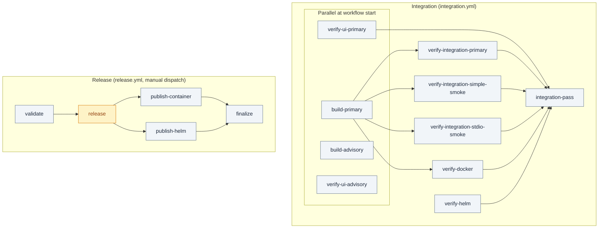

# GitHub Actions – workflow design

<!-- kairos-lint-allow-protocol-synonyms -->

## Overview

```mermaid
flowchart LR
  subgraph triggers["Triggers"]
    PR[PR → main]
    PUSH[Push → main]
    MANUAL_INT[Integration manual run on a branch]
    DISPATCH[Release dispatch (stable / prerelease)]
  end

  subgraph workflows["Workflows"]
    INT(Integration)
    REL(Release)
  end

  subgraph automation["Automation (virtual AI employee)"]
    AFX(CI failure auto-fix)
    ADM(Automerge dependabot and renovate PRs)
    AUD(npm audit fix daily)
    RBP(Rebase PRs on main)
  end

  PR --> INT
  PUSH --> INT
  PUSH --> RBP
  MANUAL_INT --> INT
  DISPATCH --> REL
  INT -->|"green run required on the exact head SHA"| REL
  INT -->|"PR run failed"| AFX
  PR -->|"bot PR"| ADM
  AUD -->|"fix(deps) PR, auto-merge"| PR
  AFX -->|"fix merged"| PUSH

  classDef trigger fill:#e2e8f0,stroke:#64748b,color:#1e293b
  classDef integration fill:#dcfce7,stroke:#16a34a,color:#166534
  classDef release fill:#fef3c7,stroke:#d97706,color:#92400e
  classDef automation fill:#ede9fe,stroke:#7c3aed,color:#4c1d95
  class PR,PUSH,MANUAL_INT,DISPATCH trigger
  class INT integration
  class REL release
  class AFX,ADM,AUD,RBP automation
```

**Release path (normal flow):** conventional-commit PRs (`feat:`/`fix:`/`feat!:`) merge to **main** → **Integration** goes green → the operator dispatches the **Release** workflow (stable: from main; prerelease: from a CI-green branch) → **semantic-release** computes the SemVer version exactly once → npm package, Docker Hub + Quay images, Helm OCI chart, git tag, and GitHub Release all publish from that single version.

**Integration:** runs on every PR to **main** (any source branch), every push to **main**, `merge_group`, and manual dispatch; it validates code, the npm tgz, the container image, and the Helm chart, and never publishes. For a prerelease from a short-lived branch, dispatch **Integration** on that branch first (it does not trigger automatically for non-main pushes), then dispatch **Release** from the same ref.

**PR/MR tooling:** This repo uses the GitHub CLI (**gh**) for PRs. For GitLab MRs use **glab**. KAIROS protocols: *GitHub PR with gh* (create/track PRs with `gh`), *GitLab MR with glab* (create/track MRs with `glab`).

### GitHub PR protocol notes: skip CI and required checks

For the GitHub PR flow, treat these as hard rules:

- Required checks are configured in GitHub repository settings (branch
  protection or rulesets), not in workflow YAML.
- Workflow files define jobs and check names, but they do not decide which
  checks block merge.
- Current `main` required checks are:
  - `Integration workflow passed`

  The former `Integration simple workflow passed` and `Integration stdio
  workflow passed` checks were retired when the simple and stdio stacks were
  folded into **Integration** as transport-smoke jobs; remove them from branch
  protection if still listed.
- `[skip ci]` style tokens only apply to workflows triggered by `push` and
  `pull_request`, and PR behavior depends on the HEAD commit message.
- If skip instructions are used but checks still run, verify the latest commit
  message first, then verify required checks in branch protection settings.

**Bot and AI automation (virtual AI employee):** Auto-merge must be allowed at repository level (Settings → General → Pull Requests → Allow auto-merge). Three workflows then run dependency/CI upkeep unattended, all keyed on the `AUTO_MERGE_TOKEN` secret (a token able to satisfy branch protection; `GITHUB_TOKEN` cannot):

- **CI failure auto-fix (Copilot)** (`ci-failure-auto-fix.yml`): on a failed PR run of **Integration**/**Security**, collects failed jobs and log excerpts, creates a triage issue, and assigns the Copilot coding agent; when Copilot opens a fix PR and its CI is green, the workflow squash-merges it. Loop protection skips Copilot-authored branches and duplicate run ids. Requires Copilot coding agent enabled for the repository (otherwise the issue is left for manual triage).
- **Automerge dependabot and renovate PRs** (`automerge-dependabot.yml`): arms GitHub auto-merge on every Dependabot/Renovate PR against `main` so bot PRs merge the moment required checks pass; `workflow_dispatch` mode arms already-open bot PRs. Renovate additionally sets `platformAutomerge` and automerges security patch/minor and non-security patch/digest updates itself (`renovate.json`).
- **npm audit fix (daily)** (`npm-audit-fix.yml`): daily `npm audit fix`; if npm blocks on an `ERESOLVE` peer-dependency conflict, or the standard fix exits successfully but leaves fixable advisories that explicitly require `npm audit fix --force`, the workflow retries once with `--force`. A plain **`fix(deps):`** PR is opened **only when a fix actually changed** `package.json`/`package-lock.json` (clean runs exit no-op) and auto-merge is armed. No version bump happens on the PR: semantic-release ships the fix as a patch the next time **Release** is dispatched.

Dependabot **version updates** are disabled (`dependabot.yml` `updates: []`); Renovate is the single dependency manager. Dependabot security alerts stay enabled and reach Renovate via `osvVulnerabilityAlerts`. Every merge to `main` also triggers **Rebase PRs on main** (`rebase-prs-on-main.yml`), which rebases all open PRs onto the new base — so a merged fix cascades to pending PRs automatically.

## Workflow classification

The redesign (`.github/AI_CI_RELEASE_REDESIGN.md`) collapsed release responsibility into **Integration** (validation) + **Release** (publication).

| Workflow | File | Role |
|----------|------|------|
| Integration | `integration.yml` | CI authority: build/tgz consumer tests, static + UI tests, integration suites, Docker/Trivy, Helm chart validation. Publishes nothing. Required check: `Integration workflow passed`. |
| Release | `release.yml` | The **only** publish path: manual dispatch → semantic-release version → npm + dual-registry images + Helm OCI + git tag + GitHub Release. |
| Security | `security.yml` | Independent scans: dependency review, npm audit, CodeQL, base-image Trivy (OS only). |
| npm audit fix (daily) | `npm-audit-fix.yml` | Plain `fix(deps):` dependency PR; versioned at the next Release dispatch. |
| CI failure auto-fix (Copilot) | `ci-failure-auto-fix.yml` | Triage issue + auto-merge Copilot fix PRs. |
| Automerge dependabot and renovate PRs | `automerge-dependabot.yml` | Arms auto-merge on bot PRs. |
| Rebase PRs on main | `rebase-prs-on-main.yml` | Rebases open PRs after each merge. |
| Sync Qoder repowiki to GitHub wiki | `sync-qoder-repowiki-to-github-wiki.yml` | Wiki sync. |
| Verify OpenAI key | `verify-openai-key.yml` | Manual secret validation. |
| Dependabot | `dependabot.yml` | Security alerts feed Renovate (`osvVulnerabilityAlerts`); version updates off. |

Deleted (absorbed): `helm-chart.yml` (→ Integration `verify-helm`), `release-tag-on-version-bump.yml`, `helm-version-bump.yml`, `publish-npm.yml`, `reusable-publish-npm.yml`, `publish-container.yml` (→ Release). Tags pushed by workflows use `GITHUB_TOKEN`, which never triggers other workflows — tag-push triggers are gone by design.

## Workflows and job dependencies

Each workflow is made of one or more **jobs**. Arrows show `needs:` — the target job runs only after the source job succeeds.



| Workflow | Job(s) | Dependencies |
|----------|--------|--------------|
| Integration | `build-primary` (24) ∥ `build-advisory` (26, COE) ∥ `verify-ui-primary` (24) ∥ `verify-ui-advisory` (26, COE); then `verify-integration-primary` ∥ `verify-integration-simple-smoke` ∥ `verify-integration-stdio-smoke` (need `build-primary`) ∥ `verify-integration-advisory` (needs `build-advisory`, COE) ∥ `verify-docker` (image-gated) ∥ `verify-helm` (chart-gated); → `integration-pass` | `integration-pass` needs `build-primary`, `verify-ui-primary`, `verify-integration-primary`, `verify-integration-simple-smoke`, `verify-integration-stdio-smoke`, `verify-docker`, `verify-helm` (advisory jobs omitted; `verify-docker`/`verify-helm` required only when image/chart-affecting files change) |
| Release | `validate` → `release` → (`publish-container` ∥ `publish-helm`) → `finalize` | `release` needs `validate`; publish jobs need `release` (and skip when nothing released); `finalize` needs all three |
| Security | `dependency-review`, `npm-audit`, `codeql` | — (parallel jobs) |
| CI failure auto-fix (Copilot) | `triage` → `auto-merge-fix` | `auto-merge-fix` needs `triage` |
| Automerge dependabot and renovate PRs | `automerge` | — |
| npm audit fix (daily) | `audit-fix` | — |
| Rebase PRs on main | `rebase` | — |

## Integration workflow

### Secrets and variables

The integration workflow uses **optional secrets:** `OPENAI_API_KEY` (embedding tests), `KEYCLOAK_ADMIN_PASSWORD`, `KEYCLOAK_DB_PASSWORD`, `SESSION_SECRET`. In the workflow they are referenced as `${{ secrets.OPENAI_API_KEY }}` etc. Non-sensitive values use **repository variables** as `${{ vars.VAR_NAME }}`. If optional secrets are not set, the job uses fixed defaults for Keycloak and generates `SESSION_SECRET` so the job runs without any secrets.

**Triggers:** `pull_request` / `push` to **main**, `merge_group`, and `workflow_dispatch` (run on any branch to validate it before a prerelease dispatch). There is **no tag trigger**: release tags are pushed with `GITHUB_TOKEN` by the Release workflow, which does not trigger workflows; release eligibility is enforced by the Release workflow's `validate` job instead.

**Actions → Integration → Run workflow** (workflow_dispatch).

**Jobs:** **`build-primary`** — **no Docker infra**; Node **24** only; `npm ci`, `npm run build:tgz`, **`npm run test:tgz`**, uploads **`npm-package-node24`** (merge gate). **`build-advisory`** — Node **26** with **`continue-on-error: true`**; uploads **`npm-package-node26`** (not in **`integration-pass`** `needs`). **`verify-ui-primary`** runs **in parallel** with build jobs on **Node 24 only** (version check, lint skills, `npm ci`, Playwright cache, **`ci-parallel-checks.mjs`** — tsc + Knip + UI tests, no tgz). **`verify-ui-advisory`** mirrors the same steps on **26** with per-Node Playwright cache keys and **`continue-on-error`** (advisory; not in **`integration-pass`** `needs`). **`verify-integration-primary`** (`needs: build-primary`) downloads **`npm-package-node24`** after infra is up (Compose + `npm ci` overlap per job layout); then Playwright + infra wait, Keycloak, `npm install` from tgz, `dev:start`, **`dev:test`** (the **one** full Jest integration suite — read-only-first fail-fast then the mutating write/auth phase — including **`http-auth`** and related scenario contracts selected for the AUTH stack via `scripts/deploy-run-env.sh`). **`verify-integration-simple-smoke`** / **`verify-integration-stdio-smoke`** (`needs: build-primary`) reuse the same tgz and boot the simple (HTTP no-auth) and stdio stacks to run a **transport smoke subset only**. **`verify-integration-advisory`** (`needs: build-advisory`, COE) mirrors 26. **`verify-docker`** (`needs: build-primary`, **image-gated**) stages `package.tgz`, **`docker build` (runtime-ci)**, **Trivy**. **`verify-helm`** (chart-gated) validates the chart end to end: `helm dependency build`, `helm lint --strict`, helm-unittest, `ct lint` (chart-testing), and kubeconform on rendered manifests. **`integration-pass`** requires the Node-24 primary jobs plus `verify-docker` (when image-affecting files change) and `verify-helm` (when chart-affecting files change; skips accepted otherwise). Use **Integration workflow passed** as the single required check.

### Node policy (24 merge gate, one Current advisory)

- **`build-primary`** / **`verify-ui-primary`** / **`verify-integration-primary`** are **Node 24 only** and are the only jobs **`integration-pass`** depends on for multi-Node coverage (plus **`verify-docker`** / **`verify-helm`**).
- **`build-advisory`** / **`verify-ui-advisory`** / **`verify-integration-advisory`** run **one** pinned **Node Current** lane (**26** in workflow YAML) with advisory **`continue-on-error`** and are **omitted** from **`integration-pass`** `needs` so that lane cannot fail the merge gate when Node 24 is green.
- **Do not** add per-job check names to branch protection; keep the single required check **Integration workflow passed**.

**Transport smoke** (`verify-integration-simple-smoke`, `verify-integration-stdio-smoke`): the **full** functional suite runs once on the AUTH stack (`verify-integration-primary`). The simple (HTTP no-auth) and stdio stacks only run a small boot/serve smoke subset against the same **`npm-package-node24`** tgz, so their transports stay covered without re-spending embedding/OpenAI quota on repeated full runs.

**Caching:** **`verify-ui-primary`** uses the same **`~/.cache/ms-playwright`** key as **`verify-integration-primary`** / **`verify-integration-advisory`** (lockfile hash only). **`verify-ui-advisory`** uses a **Node-version suffix** on the Playwright cache key so the advisory runner does not contend with the Node 24 primary cache. Integration verify jobs restore/save **Docker infra** images (`compose.yaml` hash).

### Path-filter gating (Pattern B)

**`integration.yml`** prefixes its job graph with a lightweight **`changes`** job that uses [`dorny/paths-filter@v4`](https://github.com/dorny/paths-filter) to set `code=true` only when files that can affect build/test outcomes are touched, plus narrower `image=true` and `helm=true` outputs for container/Trivy and chart-validation inputs. Heavy jobs (build, verify-ui, verify-integration primary + smoke) gate on `needs.changes.outputs.code == 'true'`; **`verify-docker`** gates on `needs.changes.outputs.image == 'true'`; **`verify-helm`** gates on `needs.changes.outputs.helm == 'true'` — so docs-only / wiki-only PRs skip the expensive work while the gate job (**Integration workflow passed**) still reports success and satisfies required-status-check branch protection (it accepts skipped `verify-docker`/`verify-helm` when their filters are false).

**Forced run** (`code=image=helm=true` regardless of paths) for: `workflow_dispatch`, `merge_group`, and runs on **`ci/**`** branches (via workflow_dispatch). The forcing logic lives in the `Combine with forced-run events` step of the `changes` job.

When adding new build inputs, update the `code:` filter list in **`integration.yml`** (and the `image:` / `helm:` filters when the input affects the container or the chart). The full `code` filter list covers `src/**`, `tests/**`, `scripts/**`, `skills/**`, root config (`package.json`, `package-lock.json`, `tsconfig*.json`, `jest.config.js`, `vitest.config.ts`, `vite.config.ts`, `postcss.config.js`, `eslint.config.cjs`, `eslint/**`, `knip.config.ts`), container files (`Dockerfile*`, `compose.yaml`), `.trivyignore`, `.env.dev_simple`, `.env.dev_stdio`, and the workflow's own YAML. The `image` filter is the container subset; the `helm` filter covers `helm/kairos-mcp/**`, `ct.yaml`, and the workflow YAML.

**Note:** Primary integration verify cannot start until **`build-primary`** finishes (artifact). Within that job, **infra starts before the artifact download** so pulls and boot overlap post-build wall clock plus later steps.

**Job summary:** Most steps append a **Vitest-style** block to `$GITHUB_STEP_SUMMARY` (`##` title, `### Summary`, ✅/❌ bullets) via `scripts/ci-github-step-summary.mjs`. The parallel checks step appends tsc and Knip summaries after all three commands finish. **Vitest** adds its own “Vitest Test Report” when `CI=true` (`vitest.config.ts`). **Jest** integration tests append “Jest integration tests” via `tests/reporters/jest-github-summary-reporter.cjs` when `GITHUB_STEP_SUMMARY` is set (`scripts/deploy-run-env.sh`).

### Integration test matrix (contracts and scenarios)

Transport-neutral MCP checks live under **`tests/integration/contracts/`** (shared assertions). **`tests/integration/harness/`** holds per-scenario bootstrap (`http-auth`, `http-simple`, `stdio-simple`) and helpers. **`tests/integration/scenarios/`** contains thin Jest files that bind one contract to one harness.

Default **`npm run dev:test`** / **`dev_simple:test`** / **`dev_stdio:test`** (via `ENV=… ./scripts/deploy-run-env.sh test`) already runs the right scenario wrappers for each stack: `scripts/deploy-run-env.sh` ignores mismatched scenario files so the auth job does not pick up `http-simple` or `stdio-simple` wrappers, and so on.

To run a single scenario explicitly (after the matching stack is up):

- `npm run test:integration:contracts:http-auth`
- `npm run test:integration:contracts:http-simple`
- `npm run test:integration:contracts:stdio-simple`

## Release workflow (manual dispatch)

**Release** (`release.yml`) is `workflow_dispatch`-only and is the **only** path that publishes anything. It implements the canonical pipeline from `.github/AI_CI_RELEASE_REDESIGN.md`.

**Version authority:** [semantic-release](https://semantic-release.gitbook.io/semantic-release/) with `release.config.mjs` at the repo root. Conventional commits since the last tag decide the version (`fix:` → patch, `feat:` → minor, `feat!:`/`BREAKING CHANGE:` → major); the operator chooses **when** to release, never the number. The stable channel is `main`; prereleases run from any CI-green non-main branch via `KAIROS_PRERELEASE_BRANCH`/`KAIROS_PRERELEASE_CHANNEL` (no permanent `dev`/`next` branch). semantic-release pushes the git tag (`vX.Y.Z`, GITHUB_TOKEN) and creates the GitHub Release; its exec plugin `prepareCmd` bumps `package.json`, re-syncs skills/compose/helm **in the job workspace only**, and builds + consumer-tests the packed tgz before anything is published. The in-repo `package.json`/skills/compose/helm versions remain the *last synced baseline* — they are not bumped by release PRs anymore.

**One version propagates everywhere:** npm `@jakub-plichcinski/kairos-mcp@<version>` (dist-tag `latest` for stable, the channel for prereleases), images `jakubplichcinski/kairos-mcp:<tags>` and `quay.io/<QUAY_NAMESPACE>/kairos-mcp:<tags>` (stable: `X.Y.Z`, `X.Y`, `X`, `latest`; prerelease: `X.Y.Z-<channel>.N`, `<channel>` — never `latest`), Helm chart `oci://quay.io/<QUAY_NAMESPACE>/kairos-mcp` with chart `version`/`appVersion`/`app.image.tag` = the exact release version, git tag `v<version>`, and the GitHub Release.

### Dispatch runbook

1. **Stable release:** merge conventional-commit PRs to `main` → wait for **Integration** green on the main head → **Actions → Release → Run workflow** → branch `main`, `release-type=stable`. CLI: `gh workflow run release.yml --ref main -f release-type=stable`.
2. **Prerelease:** keep a short-lived branch with `feat:`/`fix:` commits → dispatch **Integration** on that branch (**Actions → Integration → Run workflow**, branch selected) and wait for green → **Actions → Release → Run workflow** → the branch, `release-type=prerelease`, `channel` (default `beta`). CLI: `gh workflow run release.yml --ref <branch> -f release-type=prerelease -f channel=beta`.
3. **Preview:** `dry-run=true` shows the next version semantic-release would compute; nothing is published (prepare/publish are skipped entirely).
4. **Recovery:** `republish=true` re-publishes artifacts for the latest tag when a previous run failed mid-pipeline — it falls back to the latest tag reachable from HEAD when semantic-release has nothing to release, and tolerates "already published" npm/chart versions (both are immutable). Always investigate why the original run failed first.

The `validate` job enforces the dispatch gates: stable ⇒ ref is `main`; prerelease ⇒ ref is a non-main **branch** with a valid channel name (lowercase, never `latest`); `.trivyignore` entries must not be expired; and the exact head SHA must have a **successful Integration run** (polls the Actions API; dispatch Integration first for non-main refs). Dispatching controls timing only — it can never bypass validation.

### Jobs

1. **`validate`** — ref eligibility, `.trivyignore` expiry guard, green Integration on the exact head SHA.
2. **`release`** (environment `release`) — lint, skills-ref validation, knip, then `npx semantic-release`: computes the version, tags, creates the GitHub Release, consumer-tests the packed tgz, and publishes npm via **OIDC trusted publishing** (no `NPM_TOKEN`; `--provenance`; dist-tag `latest`/channel; already-published versions tolerated only in `republish` mode). Generates the npm CycloneDX SBOM.
3. **`publish-container`** (environment `release`) — ONE `docker/build-push-action` invocation publishes every alias to **both** registries (single-digest invariant), with BuildKit GHA cache, cosign keyless signing (digest, both registries), CycloneDX SBOM, and the Trivy CRITICAL/HIGH gate against `.trivyignore`.
4. **`publish-helm`** (environment `release`) — `scripts/helm-set-release-version.mjs <version>` pins chart `version`/`appVersion`/`app.image.tag`, then dependency build, strict lint, package, and `helm push` to `oci://quay.io/<QUAY_NAMESPACE>` (chart SemVer identity, immutable; already-exists tolerated only in `republish` mode).
5. **`finalize`** — attaches the SBOMs to the GitHub Release and writes the run summary (version, dist-tag, digest, artifact links, recovery warnings).

When semantic-release has nothing to release, `release` sets `skip=true`, the publish jobs skip, and the run ends **green** with a "nothing to release" summary — re-running cannot silently create a different artifact under the same version.

### Secrets and variables (Release)

- **Secrets:** `DOCKER_USERNAME` / `DOCKER_PASSWORD` (Docker Hub), `QUAY_USERNAME` / `QUAY_PASSWORD` (Quay — both the image push and the Helm OCI push). `GH_PAT` is still used by the automation workflows (auto-fix, automerge, audit-fix, rebase), **not** by Release.
- **Variable:** `QUAY_NAMESPACE` (Quay namespace, e.g. your Quay username).
- **npm:** no secret — OIDC trusted publishing via the job's `id-token: write` permission.

### One-time setup (external)

1. **Create the `release` environment** (Settings → Environments → New environment → `release`). Optional but recommended: add required reviewers so every publish waits for a human approval, and restrict it to the `main` branch if you want prereleases to use a separate environment later.
2. **npm trusted publisher:** on npmjs.com, update the trusted-publisher entry for `@jakub-plichcinski/kairos-mcp` to the new workflow path **`.github/workflows/release.yml`** and environment **`release`** (it previously pointed at `.github/workflows/reusable-publish-npm.yml`). Without this, `npm publish` fails with an OIDC auth error.
3. **Tag pushes:** branch protection must continue to allow GitHub Actions (GITHUB_TOKEN) to create `v*` tags — the same rule the old tag workflow relied on.

## Helm chart versioning

The chart (`helm/kairos-mcp/Chart.yaml`) no longer carries an independently bumped `version`:

1. **Release identity** (`version` + `appVersion` + default `app.image.tag`): set to the **exact release version** by the Release workflow's `publish-helm` job (`scripts/helm-set-release-version.mjs`) — prereleases included — and pushed to `oci://quay.io/<QUAY_NAMESPACE>/kairos-mcp` (SemVer identity, immutable).
2. **In-repo baseline:** the committed `Chart.yaml`/`values.yaml` values are the last synced baseline; `npm run version:sync` → `helm:sync-app-version` updates them for stable releases only (prereleases never dirty the in-repo baseline).
3. **Dependencies** (subchart versions, third-party images): managed by Renovate (`deps(helm)` and `deps(helm-images)` groups).

There is no chart auto-bump workflow and no "chart version must exceed main" CI guardrail anymore — chart PRs are validated by Integration's `verify-helm` job, and chart release identity always equals the app release version.

## Docker: release vs local dev

- **Node:** Published **Dockerfile** / **Dockerfile.dev** images use **Node LTS** (see `FROM`). A single **Node Current** line is validated in GitHub Actions via `setup-node` only; we do not publish a separate “Current” container unless product asks for it.
- **Release** (CI and `npm run docker:build`): **Dockerfile** installs the published package from npm (`@jakub-plichcinski/kairos-mcp@${PACKAGE_VERSION}`). No source build; version is a required build-arg. The Release workflow passes the semantic-release version.
- **Local dev** (build from source): **Dockerfile.dev** copies source and runs `npm run build` inside the image. Use `npm run docker:build:dev` or `docker build -f Dockerfile.dev -t kairos-mcp:dev .`. No publish required.

## Extension points

- **Automated security releases (future):** a trusted workflow may dispatch **Release** via the Actions API (`POST /repos/{owner}/{repo}/actions/workflows/release.yml/dispatches` with a `GH_PAT` that has `workflow` scope) after a security PR merges — the same `validate` gates (green Integration, ref rules) and the same single version authority apply. Do not build a second release mechanism; security automation should remove human latency, not release correctness.
- **Ephemeral Kubernetes install test (future):** a throwaway-cluster `helm install` + smoke job could be added to Integration (pre-merge) or as a pre-publish Release job; the current `verify-helm` job validates rendered manifests with kubeconform instead.
