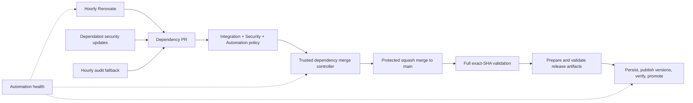

# GitHub Actions – workflow design

<!-- kairos-lint-allow-protocol-synonyms -->

## Overview

[Release and dependency automation](../../.agents/skills/kairos-dev/references/release-semver.md) is the authoritative runbook for schedules, credentials, rollout, semantic versioning, prereleases, artifact identity and recovery. Automation is disabled until its rollout prerequisites are verified. Copilot auto-fix is outside the release path and remains disabled.

## Workflows

| Workflow | File | Responsibility |
|----------|------|----------------|
| Integration | [integration.yml](integration.yml) | Node 24 build, packed-consumer install, AUTH integration, HTTP/STDIO smoke, UI/static, container/Trivy and Helm validation. Publishes nothing. |
| Security | [security.yml](security.yml) | Blocking dependency review on PRs, npm audit, CodeQL, base-image scan and exception expiry checks. |
| Automation policy | [automation-policy.yml](automation-policy.yml) | Conventional PR titles, deterministic automation regressions, workflow validation and strict Renovate config validation. |
| Renovate | [renovate.yml](renovate.yml) | Hourly routine dependency updates; no independent auto-merge. |
| Dependabot | [../dependabot.yml](../dependabot.yml) | Native security updates; version-PR limit zero. |
| npm audit fix | [npm-audit-fix.yml](npm-audit-fix.yml) | Hourly assessment and one refreshable fallback PR, respecting progressing native fixes. |
| Dependency merge controller | [automerge-dependabot.yml](automerge-dependabot.yml) | API-only reconciliation, managed branch updates and at most one protected expected-head merge. |
| Release | [release.yml](release.yml) | Single automatic npm OIDC, dual image registry, Helm, tag and GitHub Release path. |
| Automation health | [automation-health.yml](automation-health.yml) | Detect stale producers and incomplete releases; deduplicate incidents. |
| Sync Qoder repowiki | [sync-qoder-repowiki-to-github-wiki.yml](sync-qoder-repowiki-to-github-wiki.yml) | Publish generated wiki content. |
| Verify OpenAI key | [verify-openai-key.yml](verify-openai-key.yml) | Manual validation of the restricted embedding-test credential. |

## Mandatory merge gates

Repository protection, not YAML alone, makes checks mandatory. Before enabling automation, require these three GitHub Actions-bound aggregate checks with strict up-to-date protection and administrator enforcement:

- `Integration workflow passed`
- `Security workflow passed`
- `Automation policy passed`

Keep zero mandatory human approvals and use PR titles for squash commits. Do not bypass protection, approve automatically, or use skip-CI instructions. The controller independently verifies protection and fresh validation on the current PR revision. It does not update unrelated human branches.

All three validation workflows support PRs, main pushes, merge groups and manual branch validation. Checkouts use the immutable event revision without persisted credentials. Validation jobs never push generated resources or receive publishing/repository-write credentials. Only the restricted embedding-test credential is used by tests; local test-service credentials may use isolated defaults.

## Integration job graph

Node 24 is the merge-gating runtime. One Node Current lane is advisory and excluded from the aggregate's dependencies.

- `build-primary` lints, builds and consumer-tests the npm tgz, then uploads `npm-package-node24`.
- `verify-ui-primary` runs static checks, Knip and UI tests alongside the build.
- `verify-integration-primary` installs the tested tgz and runs the full AUTH suite after infrastructure startup.
- `verify-integration-simple-smoke` and `verify-integration-stdio-smoke` consume the same tgz for transport coverage without repeating the full embedding-intensive suite.
- `verify-docker` consumes that tgz through Docker's `runtime-ci` target and runs Trivy.
- `verify-helm` validates dependencies, strict Helm lint, unit tests, chart-testing and rendered Kubernetes schemas.
- `integration-pass` requires all applicable primary jobs; advisory failures never hide a primary failure.

Generated embedded resources may change in the build workspace. They are included in the tested package, never committed back during CI. Every checkout in a run uses the same immutable event revision.

### Path filters and release eligibility

PR path filters may skip expensive application work for docs-only changes. Workflow files, dependency configuration, release configuration and automation scripts are validation inputs, so workflow-only changes run the relevant tests. Update the code/image/Helm filters whenever adding build inputs.

Every main push, manual validation and merge group forces `code=image=helm=true`. A docs-only PR success is therefore never used as proof that a release artifact works: Release requires successful full main-push validation at its resolved source SHA.

### Integration test matrix

Transport-neutral assertions live in `tests/integration/contracts/`; scenario bootstrap is in `tests/integration/harness/`; wrappers are in `tests/integration/scenarios/`. The npm dev scripts select wrappers for the matching AUTH, HTTP-simple or STDIO stack.

Follow [build and test](../../.agents/skills/kairos-dev/references/build-test.md), including deployment before integration tests. After deploying the matching stack, individual contract entry points are:

- `npm run test:integration:contracts:http-auth`
- `npm run test:integration:contracts:http-simple`
- `npm run test:integration:contracts:stdio-simple`

## Release stages

`resolve` chooses one fully validated source or the oldest incomplete draft. `prepare` computes the semantic version and builds, consumer-tests, scans and seals artifacts. `publish` persists recovery bytes, verifies immutable registry identities, then promotes aliases and publishes the GitHub Release. All downstream checkouts use the resolved SHA, not a mutable branch or the completion event's SHA.

There is no old-tag republishing fallback. No releasable history is a true no-op. Incomplete releases recover the original source/version/checksums and block newer publication. See the [release runbook](../../.agents/skills/kairos-dev/references/release-semver.md#artifact-identity-and-recovery) for recovery and registry verification, including the separate `kairos-mcp-chart` Quay repository.

Release images use the validated local npm package through Docker's `runtime-ci` target. The standalone `runtime` target installs an already-published version; `Dockerfile.dev` builds local source. The Dockerfiles' pinned `FROM` declarations determine container Node versions independently of the Node 24 CI gate.

## Automation regression entry points

- `npm run test:automation`
- `npm run test:audit-fix-workflow`
- `npm run lint:workflows`
- `npm run lint:renovate`

Workflow summaries expose candidate PRs, source SHA, gate states, deferred/error reasons, version and artifact progress. Health issues remain visible for persistent failures; a successful command invocation alone is not evidence of a completed merge or publication.
