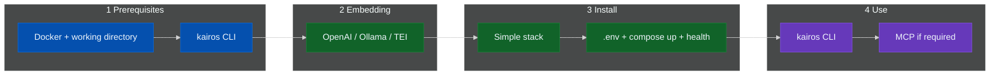

# Install KAIROS

`docs/install/` covers the supported installation flow for a local or
self-managed KAIROS deployment. Start by confirming the local requirements,
choose the embedding backend that determines your `.env` values, and then
complete the simple stack. Use the CLI as the primary interface for
authentication, verification, and day-to-day operations. Add MCP only when a
host explicitly requires it (streamable HTTP or stdio local process launch).

- **Docker Compose** — local development or single-host deployments
- **Helm chart** — Kubernetes clusters (dev, staging, production)

For both paths, start by confirming prerequisites and choosing an embedding
backend. Use the CLI as the primary interface for authentication, verification,
and day-to-day operations. Add MCP only when a host explicitly requires a
streamable HTTP endpoint.

---

## Quick start

### Docker Compose (recommended for local)

1. Review **[installation prerequisites](prerequisites.md#prerequisites)**.
2. Choose an **[embedding backend](prerequisites.md#embedding-backend)** before
   you populate `.env`.
3. Complete **[Docker Compose — simple stack](docker-compose-simple.md)**.
4. Use **`kairos`** CLI against the running server.
5. Configure **MCP** only for hosts that need it.

### Helm chart (recommended for Kubernetes)

1. Install **[operator prerequisites](helm.md#operators)**.
2. Configure a **[values file](helm.md#3-create-a-values-file)** with your
   embedding backend and hostnames.
3. Run **`helm upgrade --install`** per **[Helm installation](helm.md)**.
4. Verify with `kubectl` and `curl /health`.

If you need a broader local Docker environment, the repository also includes
**[Docker Compose — full stack (advanced)](docker-compose-full-stack.md)**.

---

## Flow

This diagram summarizes the recommended order for the Compose path.



---

## Pages in this directory

| Doc | Use for |
|-----|---------|
| [prerequisites](prerequisites.md) | Local requirements and embedding backend selection before `.env` |
| [docker-compose-simple](docker-compose-simple.md) | Recommended local path: application + Qdrant |
| [docker-compose-full-stack](docker-compose-full-stack.md) | Full stack (advanced) for broader local environment |
| [helm](helm.md) | Kubernetes deployment via Helm chart |

## CLI (required for all paths)

Install the CLI first. It is **mandatory** for all installation paths — it
provides authentication, bulk adapter management, verification, and enables
using KAIROS without adding MCP to your IDE.

```sh
npm install -g @jakub-plichcinski/kairos-mcp
kairos --help
```

To start the HTTP/MCP server from the CLI when Qdrant and `.env` are already in
place (same expectations as Compose), see **Run the server locally (`serve`)** in
[CLI](../CLI.md) (`kairos serve`).

For URL selection, authentication, and the full command surface, see
[CLI](../CLI.md).

## Cursor and MCP

Configure MCP only when your IDE or host needs it. The CLI remains the primary
interface even when MCP is enabled.

Use transport by host class:

- Streamable HTTP for containerized or remote workflows.
- stdio for local process-spawn hosts such as Claude Desktop, Cursor, and
  Claude Code.

The MCP URL uses the same host and port as `/health`, with `/mcp` appended.
Local development often uses port `3300`; the Compose examples in this
directory use port `3000`.

```json
{
  "mcpServers": {
    "KAIROS": {
      "type": "streamable-http",
      "url": "http://localhost:3000/mcp",
      "alwaysAllow": [
        "activate",
        "forward",
        "train",
        "reward",
        "tune",
        "delete",
        "export",
        "spaces"
      ]
    }
  }
}
```

```sh
curl -sS "http://localhost:3000/health"
```

- Discovery: `/.well-known/oauth-protected-resource`
- Auth: [CLI](../CLI.md#authentication), [auth overview (project Wiki)](https://github.com/jakub-plichcinski/kairos-mcp/wiki)
- Plugin: `integrations/cursor/plugin` often uses `http://localhost:3300/mcp`
- Widgets: `spaces` and `forward` use MCP Apps on hosts that support them
- Discovery scopes default to
  `openid,profile,email,kairos-groups,offline_access`; set
  `KAIROS_OIDC_SCOPES_SUPPORTED` to override this list for your IdP policy.

If MCP does not connect, verify the health URL first, confirm the host and
port, and make sure the server has Qdrant plus a working embedding backend.

## Local stdio hosts

Use stdio mode when your host spawns the MCP server process directly.

1. Build the project:

   ```sh
   npm run build
   ```

2. Start stdio mode:

   ```sh
   npm run dev:stdio
   ```

3. Configure your host command (pick one):
   - **Global install (recommended):** `command`: `kairos`, `args`: `["serve"]` (stdio is the default transport), plus `env` for Qdrant/embedding.
   - **From a checkout:** `command`: `node`, `args`: `["/absolute/path/to/kairos-mcp/dist/bootstrap.js"]`, `env`: `TRANSPORT_TYPE=stdio` (or run `kairos serve --transport stdio` from the repo after `npm run build`).

Host snippets:

- Claude Desktop:

  ```json
  {
    "mcpServers": {
      "KAIROS": {
        "command": "node",
        "args": ["/absolute/path/to/kairos-mcp/dist/bootstrap.js"],
        "env": {
          "TRANSPORT_TYPE": "stdio"
        }
      }
    }
  }
  ```

- Cursor:

  ```json
  {
    "mcpServers": {
      "KAIROS_STDIO": {
        "command": "node",
        "args": ["/absolute/path/to/kairos-mcp/dist/bootstrap.js"],
        "env": {
          "TRANSPORT_TYPE": "stdio"
        }
      }
    }
  }
  ```

- Claude Code:

  ```json
  {
    "mcpServers": {
      "KAIROS": {
        "command": "node",
        "args": ["/absolute/path/to/kairos-mcp/dist/bootstrap.js"],
        "env": {
          "TRANSPORT_TYPE": "stdio"
        }
      }
    }
  }
  ```

In stdio mode, the server writes MCP JSON-RPC frames to stdout and writes logs
to stderr.

For CI or local parity with HTTP integration tests, set

## Index

Use these links when you want broader context outside the install flow.

- [Documentation map](../README.md)
- [Main README](../../README.md)
